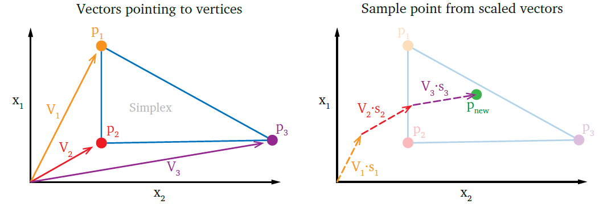

# Bayesian Bootstrap Sampling

### Table of contents

- [Bayesian Bootstrap description](#bayesian-bootstrap-description)
- [PyMAA.sampler.bayesian_sample()](#pymaasamplerbayesian_sample)

## Bayesian Bootstrap description

> **Note:** Bayesian Bootstrap is not suited for high-dimension polytopes (6+ dimensions) because the convex hull must be calculated, and QuickHull cant handle high dimensions.

Bayesian Bootstrap sampling works by calculating the convex hull representation of the polytope. Then, all simplexes that constitude the convex hull are sampled. The simplexes are obtained using Delaunay Triangulation, and the number of samples to draw from a simplex is determined by the share of the total volume for the simplex. 


Each simplex, $$P$$, is represented by its vertices, $$P = \{p^1, p^2, ..., p^{d+1}\}$$, where $$d$$ is the dimension of the polytope from which the simplexes originate.  The vectors pointing to these vertices are contained in the set of vectors, $$V = \{\mathbf{V}_1, \mathbf{V}_2, ..., \mathbf{V}_{d+1} \}$$. These vectors will be used to draw a random sample, once they have been scaled using the scaling vector, $$\mathbf{s}$$. 

The scaling vectors, $$\mathbf{s}$$, has the property that $$\sum_i \mathbf{s} = 1$$. To construct $$\mathbf{s}$$, the random vector $$r$$ must be constructed. $$\mathbf{r}$$ is constructed by by drawing $$d$$ random numbers from a normal distribution between 0 and 1, sorting them in ascending order, and then adding 0 as the first element and 1 as the last element. For a polytope with $$d = 3$$, $$\mathbf{r}$$ could be:

$$
\begin{equation}
\label{eq:r}
\mathbf{r} = \{0, 0.23, 0.45, 0.91, 1\}
\end{equation}
$$

The resulting $$\mathbf{r}$$ has $$d + 2$$ elements. Now, the difference between these components in chronological order can be used to find $$\mathbf{s}$$.

$$
\begin{equation}
\mathbf{s} = {r_{i+1} - r_i} \qquad \forall \qquad i = 1, 2, ..., (d+1)
\end{equation}
$$

The example vector from $$\cref{eq:r}$$ thus results in $$\mathbf{s} = \{0.23, 0.22, 0.46, 0.09\}$$. $$\mathbf{s}$$ and $$\mathbf{V}$$ ends up having the same number of elements.

With the scaling vector $$\mathbf{s}$$ constructed from the random vector $$\mathbf{r}$$, a new sample point can the be drawn from within the simplex, as:

$$
\begin{equation}
\mathbf{P}_{new} = \sum^{d+1}_{i=1} (\mathbf{V}_i \cdot s_i)
\end{equation}
$$

To draw a new, differenet sample, simply create new random elements in $$\mathbf{r}$$, construct a new $$\mathbf{s}$$, and calculate a new point.

Bayesian Bootstrap sampling is illustrated here:



## PyMAA.sampler.bayesian_sample()

Sample evenly within a polytope using the Bayesian Bootstrap method.

> Example from `example_3-bus_network_MAA.py`: 
> 
> ```python
> from PyMAA.sampler import bayesian_sample
> 
> samples = bayesian_sample(n_samples = 1_000_000,
>                           vertices) 
> ```

**Parameters**

| Name      | Type         | Description                                    |
| --------- | ------------ | ---------------------------------------------- |
| n_samples | int          | Number of samples to draw.                     |
| vertices  | pd.DataFrame | DataFrame containing vertices of the polytope. |

**Returns**

| Name    | Type         | Description                             |
| ------- | ------------ | --------------------------------------- |
| samples | pd.DataFrame | DataFrame containing generated samples. |
