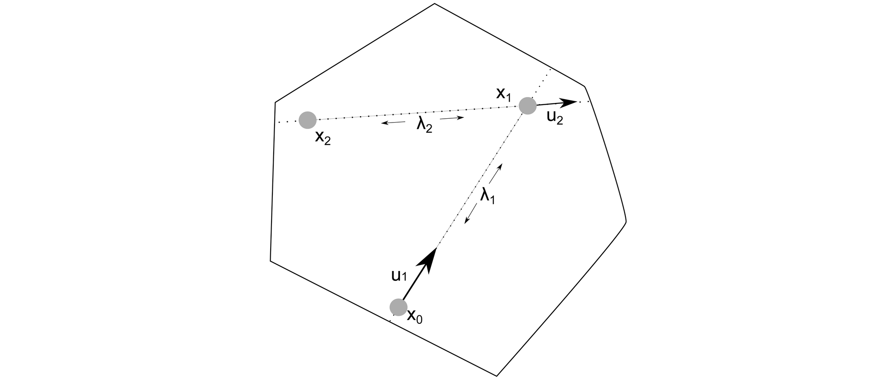

# Hit-and-Run sampling

### Table of contents

- [Hit-and-Run description](#hit-and-run-description)
- [PyMAA.sampler.har_sample()](#pymaasamplerhar_sample)

## Hit-and-Run description

> Read more about Hit-and-Run sampling [Here](https://link.springer.com/referenceworkentry/10.1007/978-1-4419-1153-7_1145)

Hit-and-Run sampling works by taking a random starting point ($$x_0$$) from within the polytope. Then, a random direction ($$u_1$$) is drawn, and a line ($$\lambda_1$$) is created in the random direction which goes through the point. With the line defined, a sample ($$x_1$$) is drawn from a random position along the line.

The Hit-and-Run process then continues iteratively, where the sample point on the line and a new random direction is used to create another line from which a sample is drawn, and so on.

Hit-and-Run sampling is illustrated here:


[*Image source*](https://www.researchgate.net/figure/Illustration-of-hit-and-run-Hit-and-run-starts-at-the-point-in-the-solution-space-It_fig5_260254555)

## PyMAA.sampler.har_sample()

Sample evenly within a polytope using the Hit-and-Run method. If initial point, *x0*, is not within polytope, the sampler automatically calculates a new point within the polytope to use.

> Example from `example_3-bus_network_MAA.py`: 
> 
> ```python
> from PyMAA.sampler import har_sample
> 
> samples = har_sample(n_samples = 1_000, 
>                      x0 = np.zeros(len(vertices.columns)), 
>                      directions = directions, 
>                      vertices = vertices)
> ```

**Parameters**

| Name       | Type          | Description                                                       |
| ---------- | ------------- | ----------------------------------------------------------------- |
| n_samples  | int           | Number of samples to draw.                                        |
| x0         | numpy.ndarray | Starting point for the sampler.                                   |
| directions | pd.DataFrame  | Directions that have been searched in using the MAA algorithm.    |
| vertices   | pd.DataFrame  | Vertices found by searching in directions with the MAA algorithm. |

**Returns**

| Name    | Type         | Description                             |
| ------- | ------------ | --------------------------------------- |
| samples | pd.DataFrame | DataFrame containing generated samples. |
