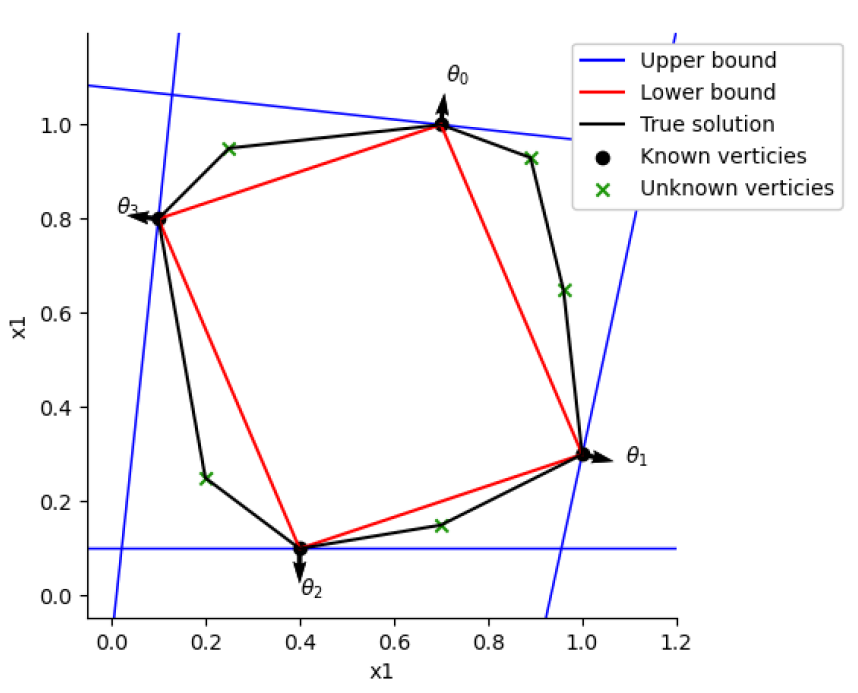

# bMAA method

### Table of contents

- [bMAA method description](#bmaa-method-description)
- [*class* PyMAA.methods.MAA(case)](#class-pymaamethodsmaacase)
  - [find_optimum()](#find_optimum)
  - [bMAA.search_directions()](#bmaasearch_directions)

# bMAA method description

> The bMAA method was first introduced in the paper Bounding the near-optimal solution space (Not yet published).

The bMAA method (Bounded Modlling All Alterntaives) uses hyperplanes to define the polytope. Each vertex of the polytope is associated with a search direction. For each iteration, the upper and lower bounds of the polytope are calculated. By drawing a small number of samples (~5000) from within the polytope, the ratio of samples inside the upper bound and inside the lower bound is used to determine the next search direction.

 This continues iteratively, until the search is stopped by a user defined criteria. 

**Pros**

- Can be used with problems in any dimension

**Cons**

- Result is not as conservative as the convex hull

The bMAA method bounds are illustrated here:

## *class* PyMAA.methods.MAA(case)

Create a method object using the bMAA method, for a given case object

> Example: `method = PyMAA.methods.bMAA(case)`

**Parameters**

| Name | Type        | Description                                                                                |
| ---- | ----------- | ------------------------------------------------------------------------------------------ |
| case | case object | PyMAA case object containing the optimization problem and required methods. See case page. |

## find_optimum()

Find the optimum solution to the given case object. This is the same regardless of method chosen (MAA/bMAA)

> Example: `opt_sol, obj = method.find_optimum()`

**Returns**

| Name    | Type  | Description                                                            |
| ------- | ----- | ---------------------------------------------------------------------- |
| opt_sol | List  | List of the optimal values for chosen variables set in the case object |
| obj     | float | objective function value at the optimum solution                       |

## bMAA.search_directions()

Performs the MAA analysis using the given method for the given case object.

> Example: `vertices, directions, _, _ = method.search_directions(n_samples = 500, n_workers = 16)`

**Parameters**

| Name             | Type  | Description                                                                                                                                                                          |
| ---------------- | ----- | ------------------------------------------------------------------------------------------------------------------------------------------------------------------------------------ |
| n_samples        | int   | Maximum number of vertices to find before stopping                                                                                                                                   |
| har_samples      | int   | Number of samples to draw each iteration for calculation of upper/lower bound ratios and to determine next directions                                                                |
| n_workers        | int   | Number of CPU threads to use for searching directions in parallel                                                                                                                    |
| max_iter         | int   | Maximum number of iterations before stopping                                                                                                                                         |
| tol              | float | Stopping tolerance for ratio between upper and lower bound                                                                                                                           |
| save_tmp_results | bool  | Whether to save results after each iteration. Saves newest results in tmp_results folder created in the working directory. Useful in case MAA analysis breaks down before completion |

**Returns**

| Name       | Type         | Description                                                |
| ---------- | ------------ | ---------------------------------------------------------- |
| vertices   | pd.DataFrame | The vertices of the polytope found during the MAA analysis |
| directions | pd.DataFrame | The directions associated with the found vertices          |
| stat       |              |                                                            |
| cost       |              |                                                            |
