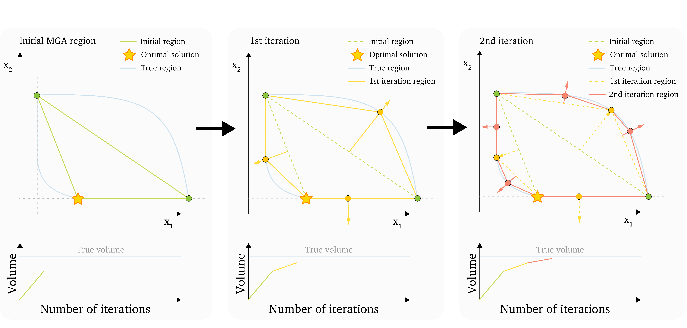

# MAA Method

### Table of contents

- [MAA method description](#maa-method-description)
- [*class* PyMAA.methods.MAA(case)](#class-pymaamethodsmaacase)
  - [find_optimum()](#find_optimum)
  - [MAA.search_directions()](#maasearch_directionsn_samples-n_workers--4-max_iter--20-save_tmp_results--true-)

# MAA method description

> The MAA method was first introduced in the paper [Modeling all alternative solutions for highly renewable energy systems](https://doi.org/10.1016/j.energy.2021.121294).

The MAA method relies on the computation of the Convex Hull of the vertices. From the initial vertices, the Convex Hull is computed using the QuickHull algorithm. The resulting hull has faces, and the face-normal directions are chosen as the next search direction.

In the following iteration, the new vertices are included, a new hull is calculaed, which yields new face-normal directions to search in.

This continues iteratively, until a stopping criteria is met. For the MAA method, the search typically stops when the volume change of the hull between iterations falls below a set tolerance.

**Pros**

- The convex hull of the polytope is well-defined by the quickhull algorithm

- Search directions are likely to yield good results

**Cons**

- Cannot be used with 7-8 or more variables, depending on problem complexity. This is because the QuickHull algorithm cannot handle high-dimension problems.

The MAA method is illustrated here:

# *class* PyMAA.methods.MAA(case)

Create a method object using the MAA method, for a given case object

Example: `method = PyMAA.methods.MAA(case)`

## find_optimum()

Find the optimum solution to the given case object. This is the same regardless of method chosen (MAA/bMAA)

**Returns**

- opt_sol - List containing the optimal values for each variable defined in the case

- obj - objective function value

- n_solved - solved PyPSA network

Example: `opt_sol, obj, n_solved = method.find_optimum()`

## MAA.search_directions()

Performs the MAA analysis using the given method for the given case object. 

**Parameters**

- n_samples - Maximum number of vertices to find before stopping.

- n_workers - Number of CPU threads to use for searching directions in parallel.

- max_iter - Maximum number of iterations before stopping

- save_tmp_results - Whether to save results after each iteration. Saves newest results in tmp_results folder created in the working directory. Useful in case MAA analysis breaks down before completion.

**Returns**

- vertices - The vertices of the polytope found duting the MAA analysis

- directions - The directions associated with the found vertices

- stat - ???

- cost - ???

Example: `vertices, directions, _, _ = method.search_directions(n_samples = 500, n_workers = 16)`
