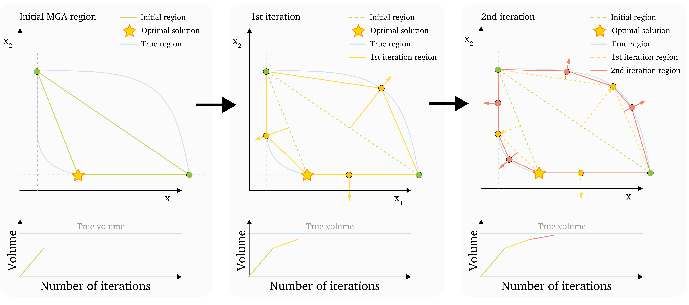

## MAA Method

This method was first introduced in the paper https://doi.org/10.1016/j.energy.2021.121294.

The MAA method relies on the computation of the Convex Hull of the vertices. From the initial vertices, the Convex Hull is computed using the QuickHull algorithm. The resulting hull has faces, and the face-normal directions are chosen as the next search direction.

In the following iteration, the new vertices are included, a new hull is calculaed, which yields new face-normal directions to search in.

This continues iteratively, until a stopping criteria is met. For the MAA method, the search typically stops when the volume change of the hull between iterations falls below a set tolerance.

**Pros**

- The convex hull of the polytope is well-defined by the quickhull algorithm

- Search directions are likely to yield good results

**Cons**

- Cannot be used with 7-8 or more variables, depending on problem complexity. This is because the QuickHull algorithm cannot handle high-dimension problems.

The MAA method is illustrated here:

# MAA method code

# PyMAA.methods.MAA()
