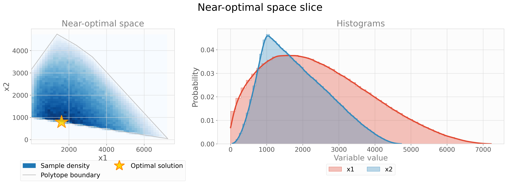

# Plot

### Table of contents

- [Plotting the near-optimal space](#plotting-the-near-optimal-space)
- [PyMAA.utilities.plot.near_optimal_space_matrix()](#pymaautilitiesplotnear_optimal_space_matrix)
- [PyMAA.utilities.plot.near_optimal_space_slice()](#pymaautilitiesplotnear_optimal_space_slice)

## Plotting the near-optimal space

As the near-optimal space is an *n*-dimensional polytope, plotting the results is challenging. PyMAA contains two plotting functions, both of which are based on projecting the polytope to 2D, and showing the histograms for each variable. 

**near_optimal_space_matrix()** is a function which projects the polytope to 2D on all variable combinations. The result is a plot which shows how each variable interacts with the others.

**near_optimal_space_slice()** is a function which projects the polytope to 2D on one combination of two user-defined variables, as well as show the histograms of both chosen variables. 

## PyMAA.utilities.plot.near_optimal_space_matrix()

Plots a matrix plot of polytope projections onto all variable combinations. Save plot by giving it a filename.

> Example from `example_3-bus_network_MAA.py`: 
> 
> ```python
>  from PyMAA.utilities.plot import near_optimal_space_matrix
> 
>  near_optimal_space_matrix(vertices = vertices,
>                            samples = samples,
>                            opt_solution = opt_sol,
>                            cheb_center = cheb_center,
>                            plot_vertices = True,
>                            )
> ```
> 
> Output:
> 
> 

**Parameters**

| Name          | Type                   | Description                                                                                      |
| ------------- | ---------------------- | ------------------------------------------------------------------------------------------------ |
| vertices      | pd.DataFrame           | DataFrame containing vertices of the space.                                                      |
| samples       | pd.DataFrame, optional | DataFrame containing samples from the space. If provided, plots distribution on each projection. |
| bins          | int, optional          | Number of bins for 2D histograms. Default is 50.                                                 |
| title         | str, optional          | Title of the plot.                                                                               |
| cmap          | str, optional          | Colormap for correlations. Default is 'Blues'.                                                   |
| xlim          | list, optional         | Optional limits for x-axis.                                                                      |
| ylim          | list, optional         | Optional limits for y-axis.                                                                      |
| xlabel        | str, optional          | Label for x-axis.                                                                                |
| ylabel        | str, optional          | Label for y-axis.                                                                                |
| opt_solution  | pd.DataFrame, optional | DataFrame containing optimal solution.                                                           |
| cheb_center   | pd.DataFrame, optional | DataFrame containing Chebyshev center.                                                           |
| plot_vertices | bool, optional         | Whether to plot vertices.                                                                        |
| plot_boundary | bool, optional         | Whether to plot the convex hull boundary.                                                        |
| filename      | str, optional          | If provided, saves the plot to a PDF file.                                                       |

**Returns**

| Name | Type                     | Description        |
| ---- | ------------------------ | ------------------ |
| axs  | numpy.ndarray            | Array of subplots. |
| fig  | matplotlib.figure.Figure | The Figure object. |

## PyMAA.utilities.plot.near_optimal_space_slice()

Plots a projection of the polytope to 2D on one combination of two chosen variables. Save plot by giving it a filename.

> Example from `example_3-bus_network_MAA.py`: 
> 
> ```python
>  from PyMAA.utilities.plot import near_optimal_space_slice
> 
>     near_optimal_space_slice(chosen_variables = ['x1', 'x2'], 
>                               vertices = vertices, 
>                               samples = samples,
>                               opt_solution = opt_sol,
>                               )
> ```
> 
> Output:
> 

**Parameters**

| Name          | Type                   | Description                                                                                      |
| ------------- | ---------------------- | ------------------------------------------------------------------------------------------------ |
| vertices      | pd.DataFrame           | DataFrame containing vertices of the space.                                                      |
| samples       | pd.DataFrame, optional | DataFrame containing samples from the space. If provided, plots distribution on each projection. |
| bins          | int, optional          | Number of bins for 2D histograms. Default is 50.                                                 |
| title         | str, optional          | Title of the plot.                                                                               |
| cmap          | str, optional          | Colormap for correlations. Default is 'Blues'.                                                   |
| xlim          | list, optional         | Optional limits for x-axis.                                                                      |
| ylim          | list, optional         | Optional limits for y-axis.                                                                      |
| xlabel        | str, optional          | Label for x-axis.                                                                                |
| ylabel        | str, optional          | Label for y-axis.                                                                                |
| opt_solution  | pd.DataFrame, optional | DataFrame containing optimal solution.                                                           |
| cheb_center   | pd.DataFrame, optional | DataFrame containing Chebyshev center.                                                           |
| plot_vertices | bool, optional         | Whether to plot vertices.                                                                        |
| plot_boundary | bool, optional         | Whether to plot the convex hull boundary.                                                        |
| filename      | str, optional          | If provided, saves the plot to a PDF file.                                                       |

**Returns**

| Name | Type                     | Description        |
| ---- | ------------------------ | ------------------ |
| axs  | numpy.ndarray            | Array of subplots. |
| fig  | matplotlib.figure.Figure | The Figure object. |
