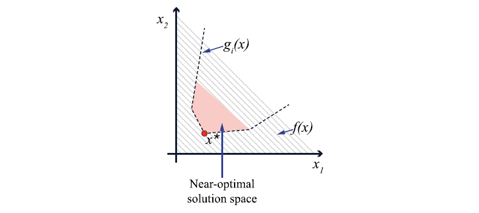

# What is Modelling All Alternatives (MAA)?

Modeling All Alternatives (MAA) is an analysis method for optimization problems, aimed at defining the near-optimal feasible space of a convex optimization problem. It is a branch of Modeling to Generate Alternatives (MGA).

The general MAA method was first presented in the paper [Modeling all alternative solutions for highly renewable energy systems](https://doi.org/10.1016/j.energy.2021.121294). More detail can be found in that paper.

This page serves as a walk-through of the overall method.

## The MGA constraint

To find the near-optimal space, it is necessary to answear the question "What is near-optimal?". Near-optimal solutions are defined as solutions which are acceptably close to the optimum. So, to find out what is near-optimal, the optimal solution and optimal objective value must be known, and a user-defined acceptable deviation must be chosen. When these parameters are known, the MGA constraint is formualted and imposed on the optimization problem. The MGA constraint is:

$$ \begin{equation}
f(\mathbf{x}) \leq f(\mathbf{x}^*) \cdot (1+\epsilon)
\label{mga_constraint}
\end{equation}
$$

Where $$f(\mathbf{x})$$ is the objective function value, $$f(\mathbf{x}^*)$$ is the optimal objective function value, and $$\epsilon$$ is the percentage slack on the objective function value, which determines how much the objective value is allowed to deviate from the optimum. 

The near-optimal space, $$W$$, can then be defined as a subspace of the feasible space, $$X$$, as:

$$ \begin{equation}
W = (\mathbf{x}|\mathbf{x} \in X, \quad f(\mathbf{x}) \leq f(\mathbf{x}^*) )
\label{nos_definition}
\end{equation}
$$

The resulting near-optimal space will be $$n$$-dimensional, where $$n$$ is the amount of variables which chosen for the MAA method. The near-optimal space will be an $$n$$-dimensional polytope.

These definitions originate from Modelling To Generate Alternatives (MGA), and are shared betwene MGA and MAA. However, typical MGA methods differ from MAA methods in that they aim to find a number of near-optimal alternatives on the boundary of the near-optimal space, whereas the MAA method aims to find the entire continous near-optimal space. The following figure illustrates the near-optimal space for a simple optimization problem.

   

*Image from [Modeling all alternative solutions for highly renewable energy systems](https://doi.org/10.1016/j.energy.2021.121294)*

## Searching for vertices

With the modelling definition of the near-optimal space in order, it must now be mapped. This is done by searching in a direction in the $$n$$-dimensional space, and finding the boundary in that direction. The search method can be random, but structured search methods are used in the MAA method (see bMAA and MAA under "2 Search Methods"). Searching is done by minimizing the MAA objective function, formulated as:

$$ \begin{align}
\text{minimize} & \quad f_{\text{MAA}}(\mathbf{x}) = \mathbf{n} \cdot \mathbf{x} \\\

\text{Subject to} & \quad \mathbf{x} \in W

\label{maa_problem}
\end{align}
$$

As increasingly more boundary points are found, the polytope which consititutes the near-optimal space is gradually revealed. 

## Sampling
